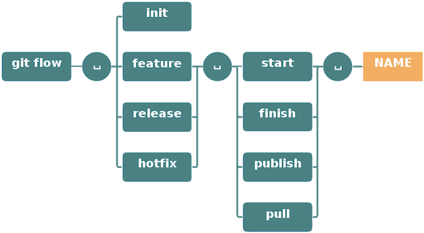

# FastAPI Course
[](https://coveralls.io/github/DamSha/FastApi-course?branch=main)
----

## Install Step for CI/CD on Heroku

- Github Actions :
[.github/workflows/main.yml](.github%2Fworkflows%2Fmain.yml)


- todo:
  - run tests in parallel, using the pytest-xdist library. (pytest ./tests/unit/ -v -s -n auto
)

## Git WorkFlow
- Utilisation de Git flow
https://les-enovateurs.com/gitflow-workflow-git-incontournableprojets-de-qualite


## Git Pre-commit
### Installation
- ```poetry add black flake8 isort bandit pre-commit --group dev```
- ```pre-commit sample-config > .pre-commit-config.yaml```
- Modifier [.pre-commit-config.yaml](.pre-commit-config.yaml)
- Installer les pre-commit du fichier config :
- ```pre-commit install```
- Lancer les tests
- ```pre-commit run -a```
### Auto-Update régulier
- ```pre-commit autoupdate```
### Problème
- Supprimer le git hooks
- ```pre-commit clean```
- Installer le git hooks
- ```pre-commit install```
- Réinstaller les hooks
- ```pre-commit install --install-hooks```

## PyEnv
- pyenv update
- pyenv install --list
- pyenv install 3.12.7
- poetry env use $(pyenv which python)

## Docker Compose
- Files :
  - [Dockerfile](Dockerfile)
  - [compose.yaml](compose.yaml)
- BUILD + RUN :
  - ```docker compose up --build```
  -

## Server Monitoring
- https://metrics.librato.com/s/public/wwmvy0ns1

## API Routes :
- /predict/supervise
- /predict/non_supervise

## Ajout de Git LFS pour les fichiers *.pkl
https://git-lfs.com/
- git lfs install
- git lfs track "*.pkl"
- git add .gitattributes
- ...

- test push > 100Mo...